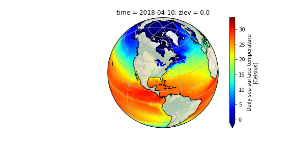
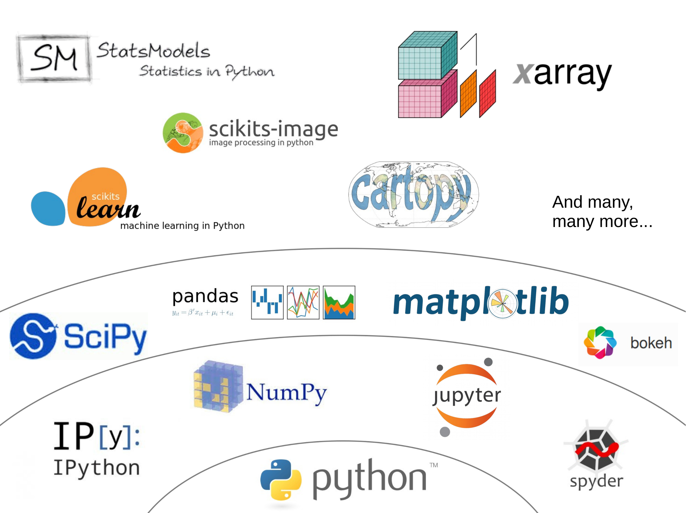

# Chapter 1 - Python for Earth Sciences

***
__Note:__ This in __not__ a tutorial for learning Python - there are many resources for that (bellow). In these tutorials we will learn the necessary Python tools required to work with satellite data.
***

__Python__ is a programming language that has reach a developing level that provides many advantages for Eartch Sciece applications:

- It is __Open Source__: it is free, everybody can use it, everybody can contribute to it
- It is used by an enourmous community of developers
- It is __Modular__: it has all the libraries *(collection of programs or functions for a specific purpose)* you could possibly need; you do not need to install them all

## This means many libraries have been developed by and for *(earth)* scientists 

***
# Python Scientific Ecosystem

There is a number of libraries and data structures that make it ideal for earth sciences: Numpy, SciPy, matplotlib, Pandas, and xarray. Because of Python modular structure, new and specific libraries are built on more basic ones taking advantage of well developed more basic libraries. For example, xarray not only on top of python, but also takes advantage of numpy, scipy, pandaas and matplotlib to name few.

***
# How to run these tutorials

There are different ways to program and run programs in Python. <u>Schematics (update)</u>

For these tutorial, we are providing a binder (cloud running image of the tutorialls) to run them online. They use Jupyter Lab as an interface.

If you decide to install Python and run these tutorial from your computer, see the resources below.

# Resources

## Where to get help
Stackoverflow

## Python Tutorials
To learn python resources: basic python

## How to install Python (using conda)
If you decide to install and rund these tutorials in your own computer

## Clone tutorials from GitHub

